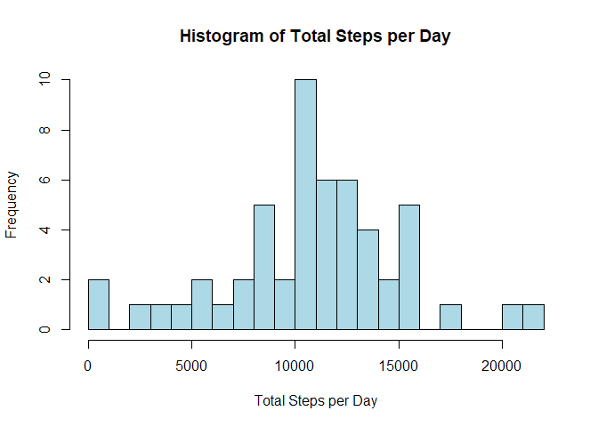
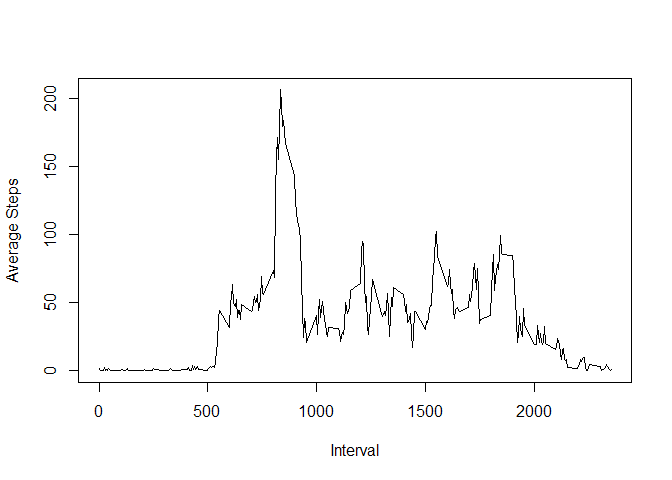
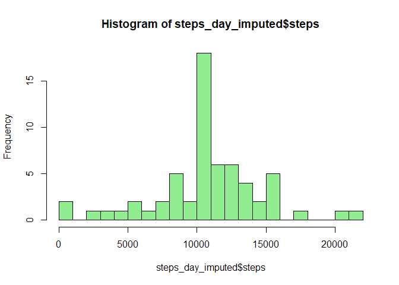
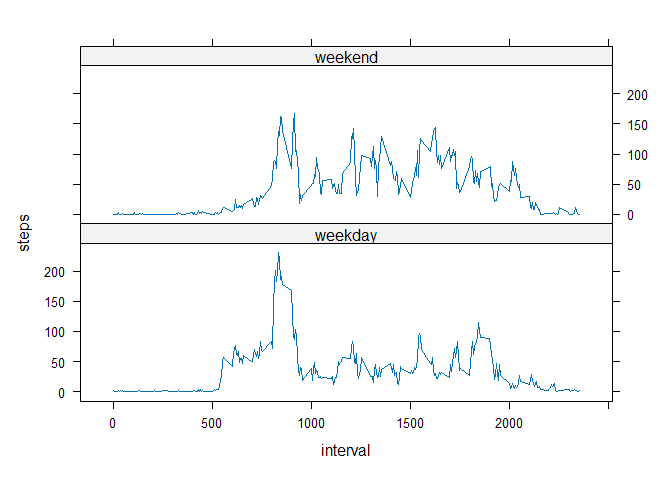

## Loading and preprocessing the data

``` r
activity <- read.csv("activity.csv")
activity$date <- as.Date(activity$date)
```

## What is mean total number of steps taken per day?

``` r
steps_per_day <- aggregate(steps ~ date, data = activity, sum, na.rm = TRUE)
```


``` r
hist(steps_per_day$steps,
     breaks = 20,
     col = "lightblue",
     main = "Histogram of Total Steps per Day",
     xlab = "Total Steps per Day")
```

<!-- -->


``` r
mean(steps_per_day$steps)
```

```
## [1] 10766.19
```

``` r
median(steps_per_day$steps)
```

```
## [1] 10765
```

## What is the average daily activity pattern?

``` r
avg_interval <- aggregate(steps ~ interval, data = activity, mean, na.rm = TRUE)
```


``` r
plot(avg_interval$interval, avg_interval$steps, type = "l", xlab = "Interval", ylab = "Average Steps")
```

<!-- -->


``` r
avg_interval[which.max(avg_interval$steps), ]
```

```
##     interval    steps
## 104      835 206.1698
```


``` r
sum(is.na(activity$steps))
```

```
## [1] 2304
```

## Imputing missing values

``` r
interval_means <- aggregate(steps ~ interval, data = activity, mean, na.rm = TRUE)
```


``` r
activity_imputed <- merge(activity, interval_means, by = "interval", suffixes = c("", ".mean"))

activity_imputed$steps[is.na(activity_imputed$steps)] <- activity_imputed$steps.mean[is.na(activity_imputed$steps)]

activity_imputed <- activity_imputed[, c("steps", "date", "interval")]
```


``` r
steps_day_imputed <- aggregate(steps ~ date, data = activity_imputed, sum)
hist(steps_day_imputed$steps, breaks = 20, col = "lightgreen")
```

<!-- -->


``` r
mean(steps_day_imputed$steps)
```

```
## [1] 10766.19
```

``` r
median(steps_day_imputed$steps)
```

```
## [1] 10766.19
```

## Are there differences in activity patterns between weekdays and weekends?

``` r
activity_imputed$day_type <- ifelse(weekdays(activity_imputed$date) %in% c("Saturday", "Sunday"), "weekend", "weekday")
activity_imputed$day_type <- factor(activity_imputed$day_type)
```


``` r
avg_daytype <- aggregate(steps ~ interval + day_type, data = activity_imputed, mean)
```


``` r
library(lattice)
xyplot(steps ~ interval | day_type, data = avg_daytype, type = "l", layout = c(1, 2))
```

<!-- -->

